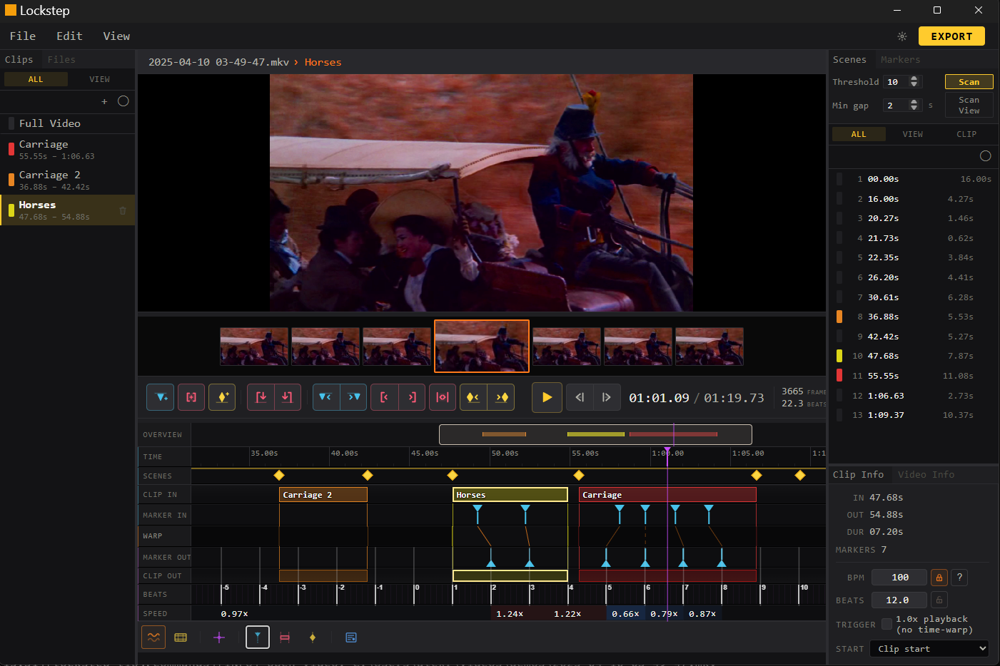

<p align="center">
  
</p>

<h1 align="center">Lockstep</h1>

<p align="center"><strong>Cut, sample, and warp video to any beat.</strong></p>

<p align="center">Chop a video into clips, snap each one to a BPM grid, time-stretch the motion inside so the beats land where they should, then export each clip as its own file.</p>



---

## Quick start

1. Open a video — click the orange **Load Video** button, or **File → Open Video…**
2. Create a clip and set its BPM in the **Clip Info** panel
3. Drop markers on the moments you want to land on a beat (press `M`, or double-click the timeline)
4. Drag each marker's beat-side handle onto the beat where it should land
5. **File → Export**

For the full walkthrough — interface tour, regions, export options, shortcuts — see the **[user guide](./docs/guide.html)**.

---

## Install

Grab the latest build from the [Releases page](../../releases). FFmpeg is bundled — nothing else to install.

- **Windows** — `.msi` or `.exe`
- **macOS** — in development
- **Linux** — `.AppImage` or `.deb`

---

## Build from source

Tauri v2 + Rust + React + TypeScript. FFmpeg does the heavy lifting for the actual time-stretch.

```bash
npm install
npm run tauri dev     # hot reload
npm run tauri build   # release build for current OS
```

FFmpeg and ffprobe must be on `PATH` for dev. For packaged releases they're bundled as `externalBin`. See [CLAUDE.md](./CLAUDE.md) for a tour of the codebase — command surface, Redux slices, and the warp pipeline.

---

## License

Lockstep is **dual licensed**:

- **AGPL-3.0** — free for personal, non-commercial, academic, and open-source use
- **Commercial License** — required for any commercial use; contact **alexrowe707@gmail.com** to inquire

See [LICENSE](./LICENSE) for the full terms.
